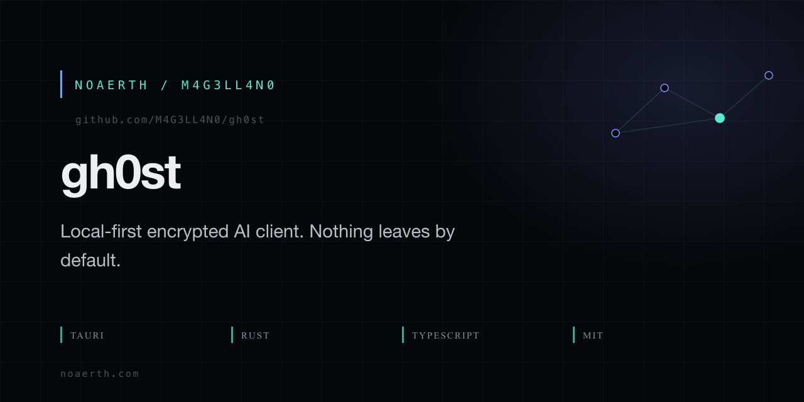

# gh0st

<p align="center">
  <picture>
    <source media="(prefers-reduced-motion: reduce)" srcset="assets/hero/hero-reduced.svg">
    <source media="(prefers-color-scheme: light)" srcset="assets/hero/hero-light.svg">
    
  </picture>
</p>

<p align="center">
  <picture>
    <source media="(prefers-reduced-motion: reduce)" srcset="assets/hero/computational-dark.svg">
    <source media="(prefers-color-scheme: light)" srcset="assets/hero/computational-light.svg">
    
  </picture>
</p>

<p align="center">
  
</p>

[](https://github.com/M4G3LL4N0/gh0st/actions/workflows/ci.yml)
[](https://github.com/M4G3LL4N0/gh0st/actions/workflows/security.yml)
[](https://opensource.org/licenses/MIT)
[](https://github.com/M4G3LL4N0/gh0st/releases)
[](https://tauri.app)
[](https://www.typescriptlang.org)
[]()
[]()
[]()

**Private AI that keeps the workspace yours.**

gh0st is a local-first interface for xAI/Grok. The CLI provides the current encrypted local-storage workflow; the macOS and browser clients are early interfaces. Conversations, files, agents, and local state stay on your device while xAI performs inference using `store=false` and, when enabled for your xAI team, verifiable Zero Data Retention.

---

## What Makes gh0st Different

| Typical Hosted AI | gh0st |
|-------------------|-------|
| Provider stores your conversation history | **Your device stores application state** |
| Provider controls your data | **xAI performs inference only** |
| Retention policies opaque | **ZDR verified dynamically from xAI response** |
| Cloud account required | **No gh0st account, no cloud** |

---

## Platform Status

| Platform | Status | Notes |
|----------|--------|-------|
| **CLI** | ✅ Available | Full 12-command interface |
| **Browser** | ✅ Available | Local dev server + production build |
| **macOS** | 🟡 Public release candidate | Native Apple Silicon shell + DMG; ad-hoc signed, not notarized; client setup limitations apply |
| **iOS** | 🟡 In Development | Code complete, simulator build pending xcodegen/cocoapods |

---

## Quick Start

### For Users (macOS)

1. **Download** the `v1.0.0-rc.1` Apple Silicon DMG from the [GitHub Release](https://github.com/M4G3LL4N0/gh0st/releases/tag/v1.0.0-rc.1)
2. **Verify** the download with the published [`SHA256SUMS.txt`](https://github.com/M4G3LL4N0/gh0st/releases/download/v1.0.0-rc.1/SHA256SUMS.txt). Expected DMG SHA-256: `cc6e9cb35d6b6908e4791fe3b815c0355487dd3d70c25c3f898250e46491cb19`
3. **Install** by dragging `gh0st.app` to Applications (or run `./scripts/mac-install.sh` from source)
4. **Launch** gh0st. The native client currently has no working Settings/API-key entry flow; use the CLI for the current encrypted workflow.

### For Developers / Source Build

```bash
# Clone the repository
git clone https://github.com/M4G3LL4N0/gh0st.git
cd gh0st

# Bootstrap (checks prerequisites, installs deps, builds)
./setup.sh

# Or manually:
pnpm install
pnpm build

# Run diagnostics
./apps/cli/dist/cli.js doctor

# Configure xAI (requires API key from https://console.x.ai)
./apps/cli/dist/cli.js doctor --setup

# Start using gh0st
./apps/cli/dist/cli.js chat          # Interactive chat
./apps/cli/dist/cli.js ask "..."     # One-shot question
./apps/cli/dist/cli.js web           # Browser UI at http://localhost:1420
./apps/cli/dist/cli.js zdr           # Verify ZDR status
```

### Browser Development

```bash
pnpm dev:client    # Starts Vite dev server at http://localhost:1420
```

---

## Privacy Architecture

```
┌─────────────────────────────────────────────────────────────────┐
│                      USER DEVICE                                │
│  ┌─────────────────────────────────────────────────────────┐   │
│  │ gh0st                                                    │   │
 │  │ ├─ CLI encrypted conversations (AES-256-GCM)          │   │
 │  │ ├─ CLI encrypted files & attachments                   │   │
 │  │ ├─ CLI agents & preferences                            │   │
 │  │ ├─ Local memory & search index (workspace)              │   │
│  │ └─ Secure credentials (CLI vault; native integration pending) │   │
│  └──────────────┬──────────────────────────────────────────┘   │
│                 │ Selected inference context                   │
│                 ▼                                              │
└─────────────────┼──────────────────────────────────────────────┘
                  │
                  ▼
┌─────────────────────────────────────────────────────────────────┐
│                      xAI / Grok                                 │
│  ├─ Inference (prompts, tool calls, code execution)            │
│  ├─ Web Search / X Search / Deep Research                      │
│  ├─ store=false  ──► No retention by xAI                       │
│  └─ x-zero-data-retention: true  ──► Verified ZDR              │
└─────────────────────────────────────────────────────────────────┘
```

**Key Points:**
- xAI sees inference content **while processing it** — this is required for the model to respond
- ZDR is about **retention after processing** — not invisibility during inference
- gh0st sends `store=false` on all requests and verifies `x-zero-data-retention: true` header
- **Strict mode** (default) blocks sensitive requests until ZDR is verified for your xAI team

---

## Features

### Conversations & Streaming
- Real-time streaming responses with token-by-token display
- Conversation history with branching (local only)
- Markdown rendering with syntax highlighting

### Encrypted Local Storage
- **CLI**: File-based JSON storage in `~/.gh0st/storage/`
- **Browser**: Local storage path; encrypted vault integration is pending
- **macOS/iOS**: Native vault integration is still in development; do not treat the current shell as hardware-backed storage
- AES-256-GCM encryption with Argon2id key derivation (64MB, 3 iterations, 4 parallel)

### Agents & Tools
| Agent | Tools |
|-------|-------|
| General | Web, X, Code |
| Researcher | Web, X, Deep Research |
| Coder | Code, Web |
| Analyst | Code, Web |
| Custom | Any combination |

### Files & Local Search
- Drag & drop: PDF, DOCX, text, code, images
- Local text extraction (pdf-parse, mammoth)
- Lexical search index built locally
- Encrypted chunked retrieval (1000 tokens, 200 overlap)

### CLI (12 Commands)
```
gh0st chat       # Interactive session
gh0st ask "..."  # One-shot
gh0st web        # Browser UI
gh0st zdr        # Verify ZDR
gh0st agents     # Manage agents
gh0st chats      # List conversations
gh0st export     # Encrypted backup
gh0st import     # Restore backup
gh0st lock       # Lock vault
gh0st wipe       # Secure delete
gh0st status     # System status
gh0st doctor     # Diagnostics
```

### Privacy Inspector
Real-time dashboard showing:
- Vault encryption status
- Conversation & file storage location
- xAI `store=false` confirmation
- ZDR verification status & timestamp
- Tool & MCP privacy boundaries

---

## ZDR Verification

gh0st **dynamically verifies** Zero Data Retention:

1. Sends harmless preflight request with `store: false`
2. Checks response header `x-zero-data-retention: true`
3. Caches result for 30 minutes
4. **Strict mode blocks** sensitive requests if ZDR unverified

> **ZDR is account/team-specific.** gh0st verifies it at runtime — it does not assume every xAI account has ZDR enabled.

---

## Security

- **Encryption**: AES-256-GCM (Web Crypto API / Ring)
- **Key Derivation**: HKDF-SHA-256 (purpose-separated keys)
- **Passphrase KDF**: Argon2id (64MB, 3i, 4p)
- **Nonce**: 12-byte random per encryption
- **Storage**: Encrypted at rest, TLS 1.3 in transit to xAI

See [SECURITY.md](SECURITY.md) for vulnerability reporting and [THREAT_MODEL.md](docs/THREAT_MODEL.md) for threat model.

---

## Documentation

| Document | Description |
|----------|-------------|
| [User Guide](docs/USER_GUIDE.md) | Complete usage documentation |
| [Privacy](docs/PRIVACY.md) | Privacy policy & data handling |
| [Security](SECURITY.md) | Security policy & reporting |
| [ZDR](docs/ZDR.md) | Zero Data Retention details |
| [Cryptography](docs/CRYPTOGRAPHY.md) | Encryption implementation |
| [Architecture](docs/ARCHITECTURE.md) | System architecture |
| [Development](docs/DEVELOPMENT.md) | Contributor guide |
| [Roadmap](ROADMAP.md) | Future milestones |

---

## Development

```bash
# Install dependencies
pnpm install

# Run all checks
pnpm typecheck
pnpm lint
pnpm test
pnpm build

# Security tests (27 tests)
pnpm test:security

# Run doctor diagnostics
./apps/cli/dist/cli.js doctor
```

### Project Structure

```
gh0st/
├── apps/
│   ├── cli/           # Node.js CLI (12 commands)
│   ├── client/        # React + Vite + Tauri 2
│   │   └── src-tauri/ # Native config (macOS/iOS)
│   └── site/          # Static documentation site
├── packages/
│   ├── core/          # Domain models
│   ├── security/      # Crypto + vault (27 tests)
│   ├── storage/       # File + IndexedDB
│   ├── xai/           # xAI HTTP/WS client
│   ├── files/         # File processing & search
│   └── ui/            # React primitives
├── docs/              # Documentation (18 files)
└── scripts/           # Build/install helpers
```

---

## Requirements

| Tool | Version | Purpose |
|------|---------|---------|
| Node.js | 20+ | Runtime |
| pnpm | 9+ | Package manager |
| Rust | 1.75+ | Tauri native |
| Xcode | 15+ | macOS/iOS builds |
| xAI API Key | — | Inference (from console.x.ai) |

---

## Contributing

See [CONTRIBUTING.md](CONTRIBUTING.md) for guidelines.

Security issues: **security@gh0st.dev** (private disclosure)

---

## License

MIT License — see [LICENSE](LICENSE) for details.

---

## Links

- **Website**: https://gh0st-six.vercel.app
- **Repository**: https://github.com/M4G3LL4N0/gh0st
- **Website source**: https://github.com/M4G3LL4N0/gh0st-website
- **Issues**: https://github.com/M4G3LL4N0/gh0st/issues
- **Discussions**: https://github.com/M4G3LL4N0/gh0st/discussions
- **Releases**: https://github.com/M4G3LL4N0/gh0st/releases
- **Security**: https://github.com/M4G3LL4N0/gh0st/security/advisories

---

*gh0st — Private AI that keeps the workspace yours.*

<!-- TRILLIONX:presentation:begin -->

### Animated surfaces

Generated from this repository's own source tree: every count, route and module below was measured, not written by hand.

#### Identity

<picture>
  <source media="(prefers-reduced-motion: reduce)" srcset="https://raw.githubusercontent.com/M4G3LL4N0/gh0st/main/.github-art/surfaces/hero-reduced.svg">
  <source media="(prefers-color-scheme: light)" srcset="https://raw.githubusercontent.com/M4G3LL4N0/gh0st/main/.github-art/surfaces/hero-light.svg">
  
</picture>

#### Entry points

<picture>
  <source media="(prefers-reduced-motion: reduce)" srcset="https://raw.githubusercontent.com/M4G3LL4N0/gh0st/main/.github-art/surfaces/terminal-reduced.svg">
  <source media="(prefers-color-scheme: light)" srcset="https://raw.githubusercontent.com/M4G3LL4N0/gh0st/main/.github-art/surfaces/terminal-light.svg">
  
</picture>

#### Modules

<picture>
  <source media="(prefers-reduced-motion: reduce)" srcset="https://raw.githubusercontent.com/M4G3LL4N0/gh0st/main/.github-art/surfaces/architecture-reduced.svg">
  <source media="(prefers-color-scheme: light)" srcset="https://raw.githubusercontent.com/M4G3LL4N0/gh0st/main/.github-art/surfaces/architecture-light.svg">
  
</picture>

#### Primitives

<picture>
  <source media="(prefers-reduced-motion: reduce)" srcset="https://raw.githubusercontent.com/M4G3LL4N0/gh0st/main/.github-art/surfaces/state_machine-reduced.svg">
  <source media="(prefers-color-scheme: light)" srcset="https://raw.githubusercontent.com/M4G3LL4N0/gh0st/main/.github-art/surfaces/state_machine-light.svg">
  
</picture>

#### Composition

<picture>
  <source media="(prefers-reduced-motion: reduce)" srcset="https://raw.githubusercontent.com/M4G3LL4N0/gh0st/main/.github-art/surfaces/component_map-reduced.svg">
  <source media="(prefers-color-scheme: light)" srcset="https://raw.githubusercontent.com/M4G3LL4N0/gh0st/main/.github-art/surfaces/component_map-light.svg">
  
</picture>

#### Build and tests

<picture>
  <source media="(prefers-reduced-motion: reduce)" srcset="https://raw.githubusercontent.com/M4G3LL4N0/gh0st/main/.github-art/surfaces/build-reduced.svg">
  <source media="(prefers-color-scheme: light)" srcset="https://raw.githubusercontent.com/M4G3LL4N0/gh0st/main/.github-art/surfaces/build-light.svg">
  
</picture>

#### Workflow

<picture>
  <source media="(prefers-reduced-motion: reduce)" srcset="https://raw.githubusercontent.com/M4G3LL4N0/gh0st/main/.github-art/surfaces/workflow-reduced.svg">
  <source media="(prefers-color-scheme: light)" srcset="https://raw.githubusercontent.com/M4G3LL4N0/gh0st/main/.github-art/surfaces/workflow-light.svg">
  
</picture>

#### Domain

<picture>
  <source media="(prefers-reduced-motion: reduce)" srcset="https://raw.githubusercontent.com/M4G3LL4N0/gh0st/main/.github-art/surfaces/domain-reduced.svg">
  <source media="(prefers-color-scheme: light)" srcset="https://raw.githubusercontent.com/M4G3LL4N0/gh0st/main/.github-art/surfaces/domain-light.svg">
  
</picture>

#### Identity object

<picture>
  <source media="(prefers-reduced-motion: reduce)" srcset="https://raw.githubusercontent.com/M4G3LL4N0/gh0st/main/.github-art/surfaces/footer-reduced.svg">
  <source media="(prefers-color-scheme: light)" srcset="https://raw.githubusercontent.com/M4G3LL4N0/gh0st/main/.github-art/surfaces/footer-light.svg">
  
</picture>

<!-- TRILLIONX:presentation:end -->

<!-- TRILLIONX:evidence:begin -->

## What is measurable here

Generated by `.github-art` from the source tree at publish time.

| Signal | Value |
| --- | --- |
| HTTP routes | 0 |
| Entry points | 24 |
| Module roots | 13 |
| Test files | 8 |
| CI workflows | 8 |
| Distinctive stack | Express |
| Status | TESTED |
| Evidence confidence | E3 |
| Animated surfaces | 9 |

<!-- TRILLIONX:evidence:end -->
